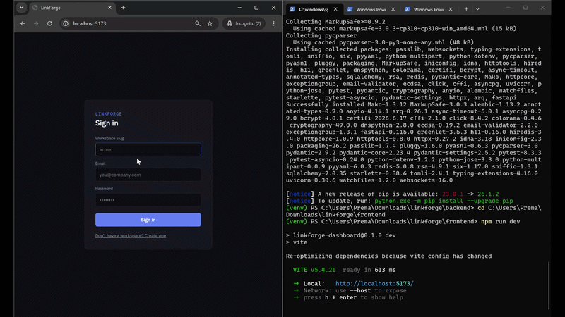

# LinkForge: Multi-Tenant Link Shortening & Analytics Platform

A multi-tenant link shortener and analytics platform built to demonstrate
backend/infrastructure depth: database-enforced tenant isolation, caching,
async processing, and measured performance under load, as a companion
piece to a separate solo-built AI/RAG project.

**Status: complete.** No live hosted demo (see below for why); the GIF
above is real, unedited footage of the system running, and the whole stack
comes up locally with one command (see "Local setup").

## Architecture

```
                     ┌─────────────┐
   Browser  ───────► │   FastAPI   │──────► Postgres (RLS, tenant_id)
  (dashboard)         │   API       │           ▲
                     └──────┬──────┘           │ SET LOCAL app.tenant_id
                            │                    │
                     ┌──────▼──────┐      ┌──────┴──────┐
                     │   Redis     │◄─────│  arq worker │
                     │ (cache +    │      │ (async click│
                     │  queue)     │      │  writes)    │
                     └─────────────┘      └─────────────┘
```

## Tech stack
- **Backend**: FastAPI (async), SQLAlchemy 2.0 (asyncpg), Pydantic v2
- **DB**: PostgreSQL with Row-Level Security (shared schema, `tenant_id` column)
- **Cache/Queue**: Redis + `arq`
- **Frontend**: React + TypeScript + Vite, live analytics via Server-Sent Events
- **Load testing**: k6
- **Infra**: Docker Compose (API, worker, Postgres, Redis, and a one-shot
  migration runner), all up with `docker compose up -d --build`

## Why no live demo
A hosted demo was part of the original plan, but both realistic free paths
have reliability trade-offs that would undercut the thing a demo is
supposed to prove: Fly.io no longer offers a genuine free tier for
multi-service apps, and Render's free tier cold-starts after 15 minutes
idle and deletes free Postgres databases after 30 days. A demo link that
occasionally 500s or spins for a minute looks worse than no demo at all.
The GIF above (signup, live SSE dashboard updates, click counts ticking
up in real time) carries no hosting-rot risk and is just as convincing.

## Key design decisions

1. **RLS, not app-level `WHERE tenant_id = ...` filtering.** Every
   tenant-scoped query is enforced at the database layer. Even if a route
   handler forgets a filter, Postgres refuses to return or mutate another
   tenant's rows.
2. **Tenant context travels via `SET LOCAL app.tenant_id`, scoped to a
   single transaction.** Set once per request from the JWT's `tenant_id`
   claim, then every query in that request is automatically scoped: no
   per-query boilerplate, no way to forget it.
3. **Five DB roles, not one; three of them exist because of real bugs
   caught along the way, not upfront design.**
   - `linkforge_owner`: migrations only, never the running app
   - `linkforge_app`: authenticated dashboard requests, tenant-scoped by RLS
   - `linkforge_authn`: signup/login only (has to search across tenants
     before it knows which one you're in)
   - `linkforge_redirect`: the public `GET /r/{code}` path, SELECT-only on
     `links`. Split out from `linkforge_app` after
     `tests/test_tenant_isolation.py` caught a real cross-tenant leak: both
     roles' policies lived on one role, and Postgres ORs permissive
     policies together per role+command, so the dashboard's list query was
     unintentionally exposed to every tenant's active links (migration 0002).
   - `linkforge_worker`: the click-tracking worker, INSERT-only on
     `clicks`. Even this narrow grant wasn't narrow enough at first;
     SQLAlchemy's ORM auto-appends a `RETURNING` clause to fetch
     server-generated columns, which silently requires SELECT on top of
     INSERT. Fixed by using a raw SQL insert instead (Week 2 retrospective).
4. **App DB role has `NOSUPERUSER` / is not the table owner, and RLS is
   `FORCE`d.** Table owners bypass RLS by default in Postgres, a mistake
   that silently defeats the whole scheme (migration 0001).

## Load test results

**Methodology:** both scenarios run against the exact same deployed code
(no feature-flagging the cache on/off) using two traffic patterns against
`GET /r/{code}` (k6, 20 constant VUs, 30 seconds, redirects not followed):

- **Cache-miss**: each VU is assigned its own private, non-overlapping
  slice of a 20,000-code pool (`load-test/seed_links.py`, which writes
  directly to Postgres, bypassing the API's own rate limiter) and works
  through it sequentially: every request gets a genuinely different code.
- **Cache-hit**: every request hits the *same* single code, so after the
  first request populates Redis, every subsequent one is served from cache.

Both scenarios are verified directly via purpose-built counters
(`metrics:cache_hit` / `metrics:cache_miss`, incremented in
`app/routers/redirect.py`), not Redis's own `INFO stats`: those global
counters turned out to be contaminated by `arq`'s own job-queue traffic on
the same Redis instance (confirmed: ~25 Redis commands per HTTP request,
far more than the cache's 1-2, once arq's enqueue/dequeue chatter was
accounted for).

**Getting a clean measurement took three attempts, which is itself worth
documenting:**
1. First attempt used a 500-code pool sampled randomly *with* replacement.
   With far more requests than codes and a 5-minute cache TTL outlasting
   the 30-second test, nearly every code got cached after its first
   appearance, the "miss" run was secretly ~97% cache hits.
2. Increasing the pool to 20,000 codes reduced but didn't eliminate this:
   sampling with replacement always leaves *some* repeat chance no matter
   the pool size (measured: 21.5% incidental hits).
3. Switching to deterministic per-VU code slicing (no randomness, no
   shared counters, so no chance of repeats) finally gave a mathematically
   guaranteed 0% hit rate for the miss scenario, but only after also
   remembering to `FLUSHDB` between runs, since leftover cached entries
   from *previous* attempts (still within their TTL) were contaminating
   supposedly-fresh runs.

| Metric | Cache-miss (verified 0% hits) | Cache-hit (verified 99.94% hits) | Change |
|---|---|---|---|
| avg | 49.94ms | 20.08ms | −59.8% |
| p90 | 60.32ms | 23.10ms | −61.7% |
| p95 | 66.74ms | 24.51ms | −63.3% |
| throughput | 397.97 req/s | 987.51 req/s | **+148.1% (2.48×)** |

**A genuine anomaly, reported rather than hidden:** the cache-hit run's
*raw max* latency (358.66ms) is actually higher than the cache-miss run's
(336.37ms), the opposite of what you'd expect. Cause: the hit scenario
starts with an empty cache (post-`FLUSHDB`), so all 20 VUs raced against
it simultaneously at t=0, and 17 of ~29,635 requests (0.06%) landed on that
initial miss before any single one finished populating the cache: a
textbook cache stampede. This is why p95 (robust to a handful of outliers)
is the headline tail metric here rather than raw max, which is highly
sensitive to rare startup contention like this.

Raw output: `load-test/results/`.

## Local setup
```bash
cp .env.example .env
docker compose up -d --build
cd backend
alembic upgrade head   # first time only, creates tables, roles, RLS policies
cd ../frontend
npm install
npm run dev
```
Backend: http://localhost:8000 · Dashboard: http://localhost:5173

## Progress log
- [x] Week 1: data model, JWT auth w/ tenant claims, RLS policies, create+redirect
- [x] Week 2: Redis cache, arq worker for async click tracking, per-tenant rate limiting
- [x] Week 3: k6 load test (with a corrected, verified methodology), React
      dashboard (SSE), Docker Compose, demo GIF

### Week 1 retrospective
- Automated tenant-isolation test caught a real bug: initial RLS design put
  both the tenant-scoped policy and the public-redirect policy on the same
  DB role. Postgres OR's permissive policies per role+command, so the
  dashboard's list-links query was unintentionally exposed to every
  tenant's active links via the redirect policy.
- Fixed by splitting into a dedicated `linkforge_redirect` role with no
  other table access, migration 0002.

### Week 2 retrospective
- Redis-cached the redirect lookup (`link:{code}` → JSON of id/tenant_id/
  target_url, 5 min TTL) so repeated hits skip Postgres entirely.
- Click tracking is fully decoupled from the redirect path: the handler
  enqueues a job onto Redis (via `arq`) and returns immediately; a separate
  worker process does the actual Postgres write on its own schedule.
- Caught a second real bug via the worker's own error logs:
  `linkforge_worker` was granted INSERT only on `clicks` (least-privilege,
  by design), but SQLAlchemy's ORM auto-appends a `RETURNING` clause to
  fetch server-generated columns (`created_at`) back into Python, and
  Postgres requires SELECT privilege for anything named in `RETURNING`,
  not just INSERT. Fixed by switching the worker to a raw SQL INSERT with
  no RETURNING. Worth knowing cold for an interview: "least privilege" has
  to account for what your ORM does under the hood, not just what your
  code appears to ask for.
- Also relied on `arq`'s built-in retry to prove the pipeline is resilient:
  jobs that failed against the old worker code were still sitting in the
  queue and succeeded automatically once the bug was fixed and the worker
  restarted, nothing was silently dropped.
- Rate limiting: fixed-window per-tenant counter in Redis (`INCR` +
  `EXPIRE`), scoped to tenant_id from the JWT, not per-user.

### Week 3 retrospective
- The load test's own methodology bugs (see "Load test results" above) are
  the more interesting lesson than the final numbers: a load test's
  *inputs* (pool size, sampling method, leftover state between runs) need
  verifying as rigorously as its outputs. Caught by noticing the "miss"
  scenario's throughput looked suspiciously close to the "hit" scenario's,
  then confirmed precisely with purpose-built app-level counters rather
  than trusting Redis's own (contaminated) global stats.
- SSE dashboard reuses the exact same tenant-scoped RLS session as every
  other authenticated route, no new DB roles or migrations needed. One
  deliberate exception to "auth via header everywhere": browsers'
  EventSource API can't send custom headers, so the JWT travels as a query
  param for this one endpoint, validated identically to the header-based flow.
- Docker Compose runs 5 services (api, worker, db, redis, one-shot
  migrate) from a single backend image with different `command:` overrides
  per service, build once, run three ways.
- Decided against live hosting given free-tier reliability trade-offs (see
  "Why no live demo" above), a deliberate scope call, not a shortcut.
